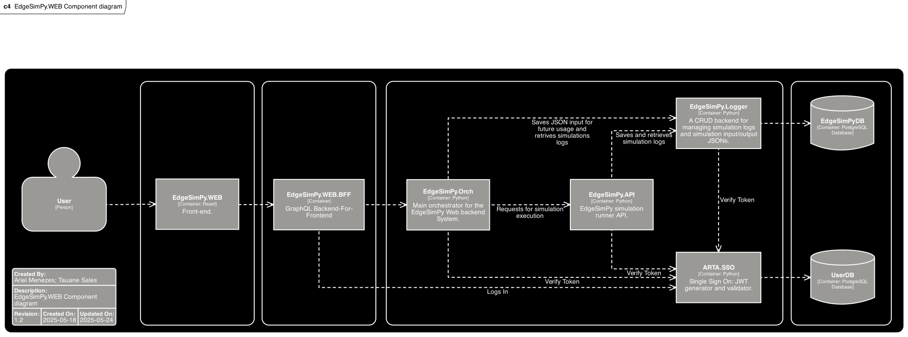

<p align="center">
  
</p>

<h1 align="center">EdgeSimPy.WEB.docs</h1>
<p align="center">
  <b>Documentation for the EdgeSimPy Web Platform</b>
</p>

---

## Overview

The `EdgeSimPy.WEB` system is a modular, microservices-based platform for simulating and analyzing Edge Computing environments. The system is composed of several independent services, each responsible for a specific aspect of the platform. Below is a high-level overview of the architecture and its main components.

---

## Getting Started with Docker

Along with centralized documentation, this repository includes a simple method to launch all system components using Docker and Docker Compose.

### Quick Launch Instructions

1. Install Docker and Docker Compose if not already installed.
2. From your repository root, run the following command to build and start all services:
  ```
  docker compose up
  ```
3. To run the containers in detached mode, execute:
  ```
  docker compose up -d
  ```
4. For details on service configuration and container mappings, review the included docker-compose.yml file.

This setup ensures that the complete EdgeSimPy Web System, including microservices and related components, can be easily started with a single command.


---

## Microservices Architecture

### 1. **[EdgeSimPy.WEB](https://github.com/ArielMAJ/EdgeSimPy.WEB)**

- **Language:** React (TypeScript)
- **Role:** The main web frontend, offering an interactive user interface for configuring, running, and visualizing simulations.

### 2. **[EdgeSimPy.API](https://github.com/ArielMAJ/EdgeSimPy.API)**

- **Language:** Python (FastAPI)
- **Role:** Runs the EdgeSimPy simulator, exposing endpoints to run simulations.

### 3. **[EdgeSimPy.Logger](https://github.com/ArielMAJ/EdgeSimPy.Logger)**

- **Language:** Python (FastAPI)
- **Role:** Receives, stores, and retrieves logs related to simulation inputs and outputs, enabling reusability of inputs and analysis of old simulation results.

### 4. **[EdgeSimPy.Orch](https://github.com/ArielMAJ/EdgeSimPy.Orch)**

- **Language:** Python (FastAPI)
- **Role:** Orchestrates the workflow between all microservices directly under the EdgeSimPy simulation functionality, coordinating simulation execution, logging, and user requests.

### 5. **[EdgeSimPy.WEB.BFF](https://github.com/ArielMAJ/EdgeSimPy.WEB.BFF)**

- **Language:** TypeScript (Node.js, Express, Apollo GraphQL)
- **Role:** Backend-for-Frontend (BFF) layer that exposes a unified GraphQL API for the frontend, aggregating data from the underlying microservices.

### 6. **[ARTA.SSO](https://github.com/ArielMAJ/ARTA.SSO)**

- **Language:** Python (FastAPI)
- **Role:** Handles authentication, user accounts, and token validation, providing secure access across the platform.

### 7. **[EdgeSimPy.WEB.Sys](https://github.com/ArielMAJ/EdgeSimPy.WEB.Sys) (this repository)**

- **Role:** Centralized documentation for high-level overview of the EdgeSimPy web system and its components, including architecture diagrams and system design.

---

## System Diagram

The following diagram illustrates the high-level C4 architecture of the EdgeSimPy Web System:

<p align="center">
  
</p>

---
